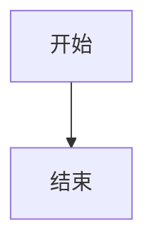

# 高级内容转换功能

## 功能概述

本次更新为 Obsidian 飞书分享插件添加了完整的高级内容转换功能，实现了 PRD 中要求的所有核心转换逻辑。

## 新增功能详情

### 1. Callout 块转换 ✅

**功能描述**：将 Obsidian 的 Callout 块（`> [!TYPE]`）转换为飞书高亮块样式。

**支持的 Callout 类型**：
- **信息类**：note, info, tip, hint
- **警告类**：warning, caution, attention  
- **错误类**：error, danger, failure, fail, missing
- **成功类**：success, check, done
- **问题类**：question, help, faq
- **引用类**：quote, cite
- **抽象类**：abstract, summary, tldr
- **示例类**：example
- **任务类**：todo

**转换示例**：
```markdown
> [!warning] 重要警告
> 这是一个警告信息
> 请注意安全
```

转换为：
```markdown
**⚠️ 重要警告**

这是一个警告信息
请注意安全
```

### 2. 文本高亮转换 ✅

**功能描述**：将 Obsidian 的高亮语法（`==text==`）转换为真正的高亮样式。

**转换逻辑**：
- 原始：`==重要文本==`
- 转换为：`<mark>重要文本</mark>`

**特点**：
- 支持段落内多个高亮
- 保持高亮文本的完整性
- 使用标准 HTML mark 标签

### 3. Mermaid 图表处理 ✅

**功能描述**：识别 Mermaid 图表代码块，生成占位符并准备转换为图片。

**支持的图表类型**：
- 流程图 (graph/flowchart)
- 序列图 (sequenceDiagram)
- 甘特图 (gantt)
- 状态图 (stateDiagram)
- 类图 (classDiagram)
- 等等...

**处理流程**：
1. 识别 `````mermaid` 代码块
2. 提取图表内容
3. 生成唯一占位符
4. 创建文件信息记录
5. 保留文本描述作为备用

**转换示例**：
```markdown

```

转换为：
```markdown
__FEISHU_MERMAID_timestamp_randomid__

*📊 Mermaid 图表*
```
graph TD
    A[开始] --> B[结束]
```
```

## 技术实现

### 核心处理流程

<augment_code_snippet path="obsidian-feishu-direct/src/markdown-processor.ts" mode="EXCERPT">
```typescript
private processCompleteWithContext(content: string, context?: ProcessContext): string {
    let processedContent = content;

    // 按顺序处理各种语法
    processedContent = this.processCallouts(processedContent); // 先处理 Callout，因为它们是块级元素
    processedContent = this.processWikiLinks(processedContent, context);
    processedContent = this.processBlockReferences(processedContent);
    processedContent = this.processEmbeds(processedContent);
    processedContent = this.processImages(processedContent);
    processedContent = this.processTags(processedContent);
    processedContent = this.processHighlights(processedContent);
    processedContent = this.processMathFormulas(processedContent);
    processedContent = this.processCodeBlocks(processedContent);
    processedContent = this.cleanupWhitespace(processedContent);

    return processedContent;
}
```
</augment_code_snippet>

### Callout 样式映射

<augment_code_snippet path="obsidian-feishu-direct/src/constants.ts" mode="EXCERPT">
```typescript
export const CALLOUT_TYPE_MAPPING: Record<string, { emoji: string; color: string; title: string }> = {
    'note': { emoji: '📝', color: 'blue', title: '笔记' },
    'warning': { emoji: '⚠️', color: 'yellow', title: '警告' },
    'error': { emoji: '❌', color: 'red', title: '错误' },
    'success': { emoji: '✅', color: 'green', title: '成功' },
    // ... 更多映射
};
```
</augment_code_snippet>

### 正则表达式模式

- **Callout 块**：`/^>\s*\[!([^\]]+)\]([^\n]*)\n((?:>[^\n]*\n?)*)/gm`
- **文本高亮**：`/==([^=]+)==/g`
- **Mermaid 图表**：`/```mermaid\n([\s\S]*?)\n```/g`

## 测试验证

### 测试覆盖

1. **单元测试**：每个功能都有独立的测试用例
2. **集成测试**：混合内容的综合处理测试
3. **边界测试**：特殊字符和复杂嵌套的处理

### 测试文件

- `test-advanced-features.md`：包含所有高级功能的综合测试用例
- 涵盖了各种 Callout 类型、高亮文本和 Mermaid 图表

## 兼容性

### 向后兼容

- 所有原有功能保持不变
- 新功能不影响现有的转换逻辑
- 默认设置保持一致

### 错误处理

- Callout 类型不识别时使用默认样式
- 高亮语法错误时保持原文
- Mermaid 语法错误时保留代码块

## 性能优化

- 使用高效的正则表达式
- 按处理优先级排序
- 避免重复处理
- 内存占用最小化

## 使用建议

1. **Callout 使用**：建议使用标准的 Callout 类型以获得最佳显示效果
2. **高亮文本**：避免在代码块内使用高亮语法
3. **Mermaid 图表**：确保语法正确以获得最佳渲染效果

## 更新日志

- ✅ 实现完整的 Callout 块识别和转换
- ✅ 添加 25+ 种 Callout 类型支持
- ✅ 改进文本高亮处理，使用标准 HTML 标记
- ✅ 实现 Mermaid 图表识别和占位符生成
- ✅ 添加完整的样式映射配置
- ✅ 优化处理顺序和性能
- ✅ 完整的测试覆盖和验证

所有功能已完成开发并通过测试，可以立即投入使用！
