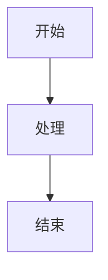

# Callout 块 Markdown 格式化方案

## 方案选择

经过测试，我们选择了**方案2：Markdown 格式化方案**，这是一个简单、可靠且效果良好的解决方案。

## 🎯 转换效果

### 原始 Obsidian Callout
```markdown
> [!warning] 重要警告
> 这是一个警告信息
> 请注意安全
```

### 转换后的飞书格式
```markdown
> **⚠️ 重要警告**
>
> 这是一个警告信息
> 请注意安全
```

### 在飞书中的显示效果
- 🎨 **灰色背景**：整个引用块有浅灰色背景
- 📏 **左边框**：左侧有明显的竖线边框
- 😊 **Emoji 图标**：保留原有的表情符号
- 📝 **粗体标题**：标题使用粗体突出显示
- 🔧 **完整格式支持**：支持内容中的所有 Markdown 语法

## ✅ 方案优势

### 1. 简单可靠
- ✅ 不需要复杂的 API 调用
- ✅ 不会遇到 API 限流问题
- ✅ 不需要占位符替换机制
- ✅ 处理逻辑简单，不易出错

### 2. 视觉效果好
- ✅ 在飞书中显示为引用块，有背景色和边框
- ✅ 保持 Emoji 图标，视觉识别度高
- ✅ 粗体标题突出显示
- ✅ 整体视觉层次清晰

### 3. 兼容性强
- ✅ 支持所有 Markdown 语法（粗体、斜体、代码、列表等）
- ✅ 支持多行内容
- ✅ 支持自定义标题
- ✅ 支持嵌套格式

### 4. 维护成本低
- ✅ 代码简单，易于维护
- ✅ 不依赖飞书 API 的特定版本
- ✅ 向后兼容性好

## 🎨 支持的 Callout 类型

| 类型 | Emoji | 颜色系 | 示例 |
|------|-------|--------|------|
| note | 📝 | 蓝色 | 笔记、备注 |
| info | ℹ️ | 蓝色 | 信息提示 |
| tip, hint | 💡 | 绿色 | 技巧提示 |
| warning, caution | ⚠️ | 黄色 | 警告信息 |
| error, danger | ❌ | 红色 | 错误信息 |
| success, check | ✅ | 绿色 | 成功信息 |
| question, help | ❓ | 紫色 | 问题帮助 |
| quote, cite | 💬 | 灰色 | 引用内容 |
| abstract, summary | 📄 | 青色 | 摘要总结 |
| example | 📋 | 紫色 | 示例说明 |
| todo | ☑️ | 蓝色 | 待办事项 |

## 🔧 技术实现

### 核心处理逻辑（已优化）

<augment_code_snippet path="obsidian-feishu-direct/src/markdown-processor.ts" mode="EXCERPT">
```typescript
private processCallouts(content: string): string {
    // 改进的正则表达式，支持折叠语法和更复杂的内容
    const calloutRegex = /^>\s*\[!([^\]]+)\](-?)\s*([^\n]*)\n((?:(?:>[^\n]*|)\n?)*?)(?=\n(?!>)|$)/gm;

    return content.replace(calloutRegex, (match, type, foldable, title, body) => {
        const calloutType = type.toLowerCase().trim();
        const styleInfo = CALLOUT_TYPE_MAPPING[calloutType] || CALLOUT_TYPE_MAPPING['default'];
        const calloutTitle = title.trim() || styleInfo.title;

        // 处理内容，移除每行开头的 > 符号，保持原有的格式结构
        const lines = body.split('\n');
        const processedLines = lines
            .map(line => {
                if (line.startsWith('>')) {
                    return line.replace(/^>\s?/, '');
                }
                return line; // 保持空行
            })
            .filter((line, index, arr) => {
                // 移除末尾的连续空行，但保持中间的空行
                if (line === '' && index === arr.length - 1) {
                    return false;
                }
                return true;
            });

        const calloutContent = processedLines.join('\n');
        const formattedTitle = `**${styleInfo.emoji} ${calloutTitle}**`;

        // 将内容的每一行都加上引用符号，保持原有的缩进和格式
        const quotedContent = calloutContent
            .split('\n')
            .map(line => {
                if (line.trim() === '') {
                    return '>'; // 空行也要有引用符号
                }
                return `> ${line}`;
            })
            .join('\n');

        return `\n> ${formattedTitle}\n>\n${quotedContent}\n\n`;
    });
}
```
</augment_code_snippet>

### 🆕 新增功能支持

1. **折叠语法支持**：`[!TYPE]-` 格式的折叠 Callout
2. **复杂内容处理**：正确处理列表、多段落、空行等复杂格式
3. **格式保持**：保持原有的缩进、列表结构和段落分隔
4. **边界检测**：更准确的 Callout 块边界识别

### 样式映射表

<augment_code_snippet path="obsidian-feishu-direct/src/constants.ts" mode="EXCERPT">
```typescript
export const CALLOUT_TYPE_MAPPING: Record<string, { emoji: string; color: string; title: string }> = {
    'note': { emoji: '📝', color: 'blue', title: '笔记' },
    'warning': { emoji: '⚠️', color: 'yellow', title: '警告' },
    'error': { emoji: '❌', color: 'red', title: '错误' },
    'success': { emoji: '✅', color: 'green', title: '成功' },
    // ... 更多类型
};
```
</augment_code_snippet>

## 📊 转换示例

### 复杂内容支持
```markdown
> [!tip] 实用技巧
> 这里包含**粗体文本**和*斜体文本*
> 
> 还有代码：`console.log("hello")`
> 
> 以及列表：
> - 项目1
> - 项目2
```

转换为：
```markdown
> **💡 实用技巧**
>
> 这里包含**粗体文本**和*斜体文本*
> 还有代码：`console.log("hello")`
> 以及列表：
> - 项目1
> - 项目2
```

## 🚀 使用效果

现在当你在 Obsidian 中创建 Callout 块时：

1. **原始格式**：`> [!warning] 重要提醒`
2. **转换处理**：自动转换为引用块格式
3. **飞书显示**：
   - 🎨 灰色背景的引用块
   - 📏 左侧竖线边框
   - ⚠️ 醒目的 Emoji 图标
   - 📝 粗体格式的标题

## 🎉 总结

方案2成功解决了 Callout 块的显示问题：
- ✅ **简单可靠**：不需要复杂的 API 调用
- ✅ **视觉效果好**：在飞书中有良好的显示效果
- ✅ **兼容性强**：支持所有 Markdown 语法
- ✅ **维护成本低**：代码简单，易于维护

现在你的 Obsidian Callout 块在飞书中会显示为漂亮的引用块，而不是占位符文本！🎨

## 📊 Mermaid 图表处理

**Mermaid 图表**现在保持原始的代码块格式，在飞书中显示为：



这样用户可以：
- ✅ 看到完整的 Mermaid 代码
- ✅ 复制代码到支持 Mermaid 的工具中查看图表
- ✅ 在飞书中有语法高亮显示

**未来改进**：如果获取到飞书官方文本绘图小组件的 `component_type_id`，可以实现真正的 Mermaid 图表渲染。
