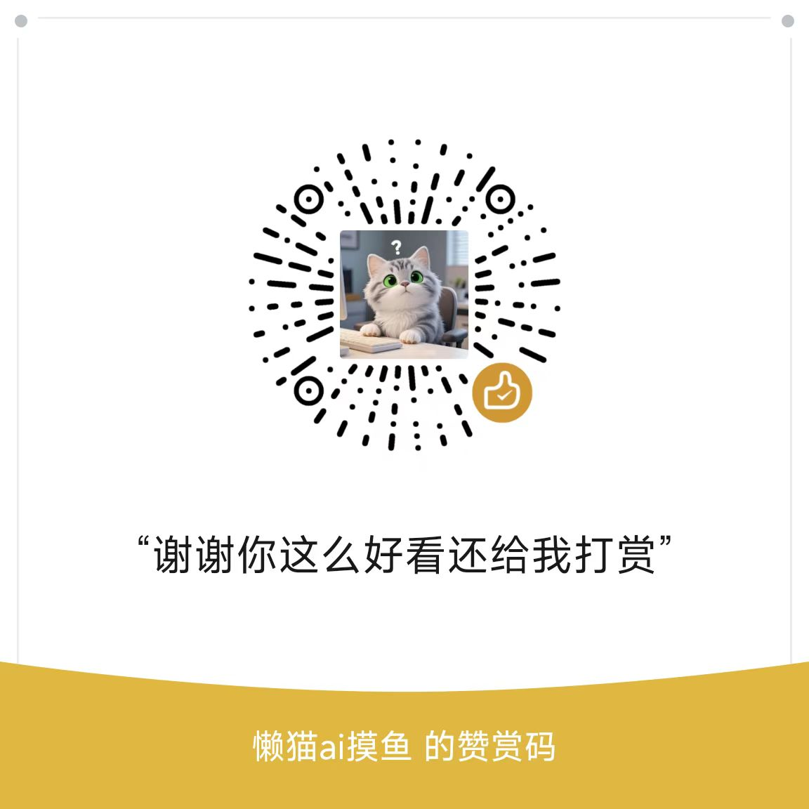

# 飞书分享 (Feishu Share)

[](https://github.com/LazyZane/feishushare)
[](https://github.com/LazyZane/feishushare/blob/main/LICENSE)
[](https://www.typescriptlang.org/)

一个功能强大的 Obsidian 插件，让您轻松将 Markdown 文档无缝分享到飞书云文档。支持完整的格式转换、文件上传、子文档嵌入和跨文档图片处理。

## ✨ 核心特性

### 🚀 分享体验
- **一键分享** - 支持命令面板、右键菜单、文件管理器多种分享方式
- **双模式支持** - 支持云空间和知识库两种分享目标
- **智能更新** - 自动识别已分享文档，支持增量更新
- **批量处理** - 使用飞书嵌套块API，大幅提升处理性能

### 🔒 安全可靠
- **官方授权** - 标准 OAuth 2.0 流程，支持自动Token刷新
- **权限可控** - 支持多种链接分享权限设置
- **数据隔离** - 直连飞书API，无第三方服务器中转
- **错误恢复** - 完善的异常处理和重试机制

### 🎨 格式兼容
- **完整Markdown** - 支持标题、列表、表格、代码块、引用等
- **Obsidian语法** - 完美处理双链、标签、嵌入等特有语法  
- **Callout转换** - 智能转换Obsidian标注块为飞书样式
- **格式保持** - 最大程度保持原文档的视觉效果

### 📎 文件处理
- **本地文件上传** - 自动上传图片、文档、表格等附件
- **🖼️ 图片处理增强** - 跨文档图片复制，智能下载重新上传
- **子文档嵌入** - 支持嵌入Markdown文件作为子文档链接
- **批量优化** - 智能批量上传，减少API调用

### 🏷️ 智能标记
- **Front Matter集成** - 自动添加分享标记、链接和时间戳
- **状态跟踪** - 记录文档分享状态，避免重复处理
- **URL管理** - 自动更新和维护飞书文档链接
- **字段保护** - 只更新相关字段，保护原有Front Matter数据

## 📦 安装

### 从 Obsidian 社区插件市场安装（推荐）
1. 打开 Obsidian 设置
2. 进入"第三方插件"页面
3. 关闭"安全模式"
4. 点击"浏览社区插件"
5. 搜索"飞书分享"或"Feishu Share"
6. 点击安装并启用

### 手动安装
1. 从 [Releases](https://github.com/Astral719/obsidian-feishu-oauth-proxy/releases) 下载最新版本
2. 解压到 Obsidian 插件目录：`{vault}/.obsidian/plugins/obsidian-feishu-direct/`
3. 重启 Obsidian 并在设置中启用插件

## ⚙️ 配置指南

### 第一步：创建飞书应用
1. 访问 [飞书开放平台](https://open.feishu.cn/)
2. 创建"企业自建应用"
3. 记录 **App ID** 和 **App Secret**
4. 在"权限管理"中添加以下权限（最小集）：
   - `user_access_token` - 用户身份权限
   - `contact:user.base:readonly` - 获取用户基本信息
   - `docx:document` - 创建、编辑文档
   - `drive:drive` - 访问云空间文件
   - `wiki:wiki`-访可和管理知识库

### 第二步：配置回调地址
在应用的"安全设置" → "重定向URL"中添加：
```
https://md2feishu.xinqi.life/oauth-callback
```

### 第三步：插件授权
1. 在 Obsidian 插件设置中输入 App ID 和 App Secret
2. 点击"🚀 一键授权"按钮
3. 在弹出的浏览器中完成飞书登录授权
4. 授权成功后即可开始使用

## 🚀 使用指南

### 📋 分享方式
插件提供多种便捷的分享方式：

#### 1. 命令面板（推荐）
- **快捷键**：`Ctrl+P` (Windows) 或 `Cmd+P` (Mac)
- **搜索命令**：输入"分享当前笔记到飞书"
- **回车执行**：直接开始分享流程

#### 2. 右键菜单
- **编辑器内**：在编辑器中右键 → 点击"📤 分享到飞书"
- **文件管理器**：在文件列表中右键 MD 文件 → "📤 分享到飞书"

### 📏 文件处理功能

#### 🖼️ 图片处理（v2.5.0 新增）
**智能图片复制** - 插件为您解决飞书图片跨文档限制问题：

- **自动识别**：检测需要处理的图片块
- **智能下载**：从源文档下载原始图片
- **重新上传**：上传到目标文档并更新引用
- **错误隔离**：单个图片失败不影响整体更新

#### 📎 本地文件上传
**支持格式**：
- **图片文件**：`` 或 `![[image.png]]`
- **附件文件**：`![[document.pdf]]` 或 `![[spreadsheet.xlsx]]`
- **多媒体**：PNG、JPG、GIF、WebP、PDF、DOCX、XLSX等

**处理流程**：
1. 扫描文档中的本地文件引用
2. 生成临时占位符替换引用
3. 上传文档内容到飞书
4. 逐个上传本地文件
5. 将占位符替换为实际文件块

#### 📄 子文档嵌入
**Markdown文件嵌入**：`![[other-note.md]]`
- 作为子文档上传到飞书
- 在原位置插入文档链接
- 支持递归处理子文档中的文件引用
- 防循环引用和深度限制保护

### 🎁 高级特性

#### 🏷️ Front Matter 集成
**自动标记** - 分享成功后自动添加：
```
---
feishushare: true                    # 分享状态标记
feishu_url: https://example.feishu.cn/... # 飞书文档链接
feishu_shared_at: 2025-01-17 10:30       # 分享时间（东8区，YYYY-MM-DD HH:mm）
---
```
#### ⛔ 代码块过滤（内容排除）
当某些代码块仅用于 Obsidian 本地样式/插件（例如 `meta-bind-embed`、`dataviewjs`），可在设置中启用“代码块过滤”：

- 在设置页“代码块过滤”中，每行输入一个语言名（大小写不敏感）：
```
meta-bind-embed
dataviewjs
```
- 被列出的 fenced code block（``` 或 ~~~）在上传到飞书前会被移除；未列出的代码块将按原样保留。

提示：仅影响 fenced code block，不影响内联代码、Callout 或 HTML。


**保护机制**：
- 只更新飞书相关字段
- 完整保留原有 Front Matter 数据
- 支持复杂 YAML 结构（数组、对象等）

#### 📦 批量优化（v2.4.0+）
**性能提升** - 使用飞书嵌套块API：
- 处理速度提升75%-99%
- API调用减少90%以上
- 智能回退机制保证兼容性
- 频率控制防止429错误

### 🎯 目标选择

#### 📁 云空间配置
1. 在插件设置中点击 **📁 选择文件夹**
2. 浏览飞书云空间文件结构
3. 选择适合的文件夹作为默认保存位置

#### 📖 知识库配置
1. 在"目标类型"中选择"知识库"
2. 点击 **📖 选择知识库** 按钮
3. 选择目标知识库空间和节点（不选节点则保存到该知识库根目录）

权限说明（最小集）：
- 用户身份权限：`user_access_token`
- 应用身份权限：`wiki:wiki`

### ✅ 分享结果

**成功提示** - 分享完成后显示：
- ✅ 成功提示和文档链接
- 📋 一键复制链接功能
- 📎 附件上传状态和结果
- 🗑️ 自动清理临时文件

**错误处理** - 出现问题时：
- 明确的错误描述和解决建议
- 自动重试和智能回退
- 详细的日志信息供排查

## 🔍 技术实现

### 核心架构
```
Obsidian插件 → 直接调用飞书API
```

### 主要功能
- **OAuth授权** - 标准OAuth 2.0流程，支持自动重新授权
- **文件上传** - 使用FormData直接上传，支持多种文件格式
- **图片处理服务** - 智能图片下载重新上传，解决跨文档图片复制问题
- **智能占位符** - 预编译正则表达式，支持早期退出优化
- **子文档处理** - 递归处理嵌入的Markdown文件
- **Token管理** - 自动刷新访问令牌，智能重试机制
- **错误处理** - 友好的错误提示和多重备用方案

### API调用
```typescript
// 文件上传示例
const formData = new FormData();
formData.append('file_name', fileName);
formData.append('parent_type', 'explorer');
formData.append('size', content.length.toString());
formData.append('file', blob, fileName);

const response = await fetch('https://open.feishu.cn/open-apis/drive/v1/files/upload_all', {
    method: 'POST',
    headers: {
        'Authorization': `Bearer ${accessToken}`,
    },
    body: formData
});
```

## 🛠️ 开发

### 项目结构
```
src/
├── main.ts                 # 主插件类
├── feishu-api.ts           # 飞书API服务（完整功能，包含图片处理服务）
├── markdown-processor.ts   # Markdown内容处理器
├── settings.ts             # 设置界面
├── manual-auth-modal.ts    # 手动授权模态框
├── folder-select-modal.ts  # 文件夹选择模态框
├── dom-utils.ts            # DOM工具函数
├── debug.ts                # 调试工具
├── types.ts                # 类型定义
└── constants.ts            # 常量配置
```

### 技术架构

```
┌─────────────────┐    ┌─────────────────┐    ┌─────────────────┐
│   Obsidian      │    │  飞书分享插件    │    │    飞书API      │
│                 │    │                 │    │                 │
│ ┌─────────────┐ │    │ ┌─────────────┐ │    │ ┌─────────────┐ │
│ │ Markdown    │◄┼────┼►│ Processor   │ │    │ │ Document    │ │
│ │ Files       │ │    │ │             │ │    │ │ API         │ │
│ └─────────────┘ │    │ └─────────────┘ │    │ └─────────────┘ │
│                 │    │ ┌─────────────┐ │    │ ┌─────────────┐ │
│ ┌─────────────┐ │    │ │ Auth        │◄┼────┼►│ OAuth       │ │
│ │ Local       │◄┼────┼►│ Service     │ │    │ │ Service     │ │
│ │ Assets      │ │    │ │             │ │    │ │             │ │
│ └─────────────┘ │    │ └─────────────┘ │    │ └─────────────┘ │
│                 │    │ ┌─────────────┐ │    │ ┌─────────────┐ │
│ ┌─────────────┐ │    │ │ Image       │◄┼────┼►│ Media       │ │
│ │ UI          │◄┼────┼►│ Processing  │ │    │ │ API         │ │
│ │ Components  │ │    │ │             │ │    │ │             │ │
│ └─────────────┘ │    │ └─────────────┘ │    │ └─────────────┘ │
└─────────────────┘    └─────────────────┘    └─────────────────┘
```

### 构建系统
```bash
# 开发构建（带监听和sourcemap）
npm run dev

# 生产构建（压缩和优化）
npm run build

# 版本管理
npm run version
```

### 核心组件
- **FeishuApiService** - 飞书API服务，处理OAuth、文档操作、文件上传
- **MarkdownProcessor** - Markdown处理器，转换Obsidian语法为飞书格式
- **ImageProcessingService** - 图片处理服务，处理跨文档图片复制
- **设置管理** - 用户配置界面，支持云空间和知识库配置
- **调试系统** - 多级日志系统，便于问题排查

## 🔧 故障排除

### 常见问题

1. **授权失败**
   - 检查App ID和App Secret是否正确
   - 确认飞书应用权限配置
   - 验证OAuth回调地址

2. **上传失败**
   - 检查文件大小（飞书有限制）
   - 确认访问令牌有效性
   - 查看控制台错误信息

3. **Token过期**
   - 插件会自动尝试刷新Token
   - 如果刷新失败，需要重新授权

### 调试方法
1. 打开Obsidian开发者工具（`Ctrl+Shift+I`）
2. 查看Console标签页的日志
3. 检查Network标签页的API请求

## 📈 项目状态

### 📊 代码质量
- **TypeScript覆盖率**: 100%
- **代码行数**: ~7000+ 行
- **核心模块**: 9个主要文件
- **API集成**: 15+ 飞书官方API
- **测试覆盖**: 包含调试和API测试功能

### 🔧 技术栈
- **开发语言**: TypeScript 4.7.4
- **构建工具**: ESBuild
- **UI框架**: Obsidian Plugin API
- **API集成**: 飞书开放平台 API
- **包管理**: npm

### 📋 依赖关系
```
{
  "runtime": {
    "obsidian": "latest",
    "typescript": "4.7.4"
  },
  "devDependencies": {
    "@types/node": "^16.11.6", 
    "esbuild": "0.17.3",
    "@typescript-eslint/*": "5.29.0"
  }
}
```

## 📝 版本历程

### v2.5.1 (当前版本) - 知识库与内容过滤增强
**🧠 知识库一致性**
- 目标为“知识库”时，子文档也自动移动至配置的知识库空间/节点（未配置节点则保存到该知识库根目录）
- 主文档与子文档处理流程对齐，链接可用

**🧾 文档属性与时间格式**
- Front Matter 命名统一为“文档属性（Front Matter）”
- `feishu_shared_at` 时间格式统一为东八区 `YYYY-MM-DD HH:mm`

**⛔ 代码块过滤（通用内容排除）**
- 设置页新增“代码块过滤”多行输入：每行一个语言名（如 `meta-bind-embed`、`dataviewjs`）
- 命中的 fenced code（``` 或 ~~~）在上传前移除；适用于主文档与子文档

**🎨 Callout 优化**
- Callout 标题保持加粗
- Callout 内容中的 `==高亮==` 解析为加粗显示（不再保留“==”符号）

**🔐 授权与默认目标**
- 未授权时，打开位置选择前进行拦截并提示授权
- 默认分享目标改为“知识库”

**🐛 Bug 修复**
- 修复代码块过滤参数未传递导致过滤不生效的问题
- 修复子文档中 Callout 占位符未替换的问题

### v2.5.0 (当前版本) - 图片处理革命
**🖼️ 跨文档图片复制**
- 新增 `ImageProcessingService` 专业图片处理服务
- 实现从源文档下载→重新上传→更新引用的完整流程
- 使用官方素材下载API (`/drive/v1/medias/{token}/download`)
- 智能图片块映射和批量处理
- 解决飞书图片token跨文档限制问题

**🔧 架构优化**
- 渐进式改造，保持100%向后兼容
- 模块化图片处理，独立错误处理
- 性能优化，减少API调用次数

### v2.4.x - 性能与稳定性
**⚡ 批量处理优化**
- 使用嵌套块API，处理速度提升75%-99%
- API调用减少90%，智能回退机制
- 频率控制和并发保护

**🛡️ 稳定性提升** 
- 完善的错误处理和重试机制
- Token刷新优化，文档访问权限检查
- 临时文档智能清理

### v2.3.x - 功能完善
**🏷️ Front Matter集成**
- 自动添加分享标记和链接
- 支持时间戳和状态跟踪
- 保护原有YAML结构

**🔗 链接处理优化**
- Obsidian协议链接优化
- 权限设置和分享控制
- UI界面美化和响应式设计

### v2.3.0
- 🏷️ **自动分享标记** - 新增分享成功后自动在Front Matter中添加标记功能
  - 支持自动添加 `feishushare: true` 标记
  - 记录分享链接 `feishu_url` 和分享时间 `feishu_shared_at`（东8区时间）
  - 主文档和子文档都会自动添加分享标记
  - 功能默认开启，可在设置中关闭
  - 重复分享时自动更新时间戳
- 🔗 **链接处理优化** - 优化Obsidian协议链接的显示方式
  - 将 `[文本](obsidian://...)` 转换为 `文本(obsidian://...)` 格式
  - 避免飞书导入时将协议链接转换为纯文本，保留完整URL信息

### v2.2.0
- 🎨 **UI优化** - 全新的设置界面设计，更加美观易用
- 💝 **赞赏功能** - 新增开发者赞赏功能，支持作者继续开发
- 🔧 **代码重构** - 优化代码结构，提升性能和可维护性
- 🐛 **Bug修复** - 修复了多个已知问题，提升稳定性
- 📱 **响应式设计** - 设置界面适配不同屏幕尺寸

### v2.1.0
- 🎉 **文件上传功能** - 支持自动上传本地图片和附件
- 📄 **子文档支持** - 支持嵌入Markdown文件作为子文档链接
- 🔍 **性能优化** - 智能占位符搜索，支持早期退出
- 🔧 **错误处理** - 增强的错误处理和重试机制
- ⚡ **用户体验** - 实时进度提示和状态更新

### v2.0.0
- 🎉 首个Direct版本发布
- ✅ 直接调用飞书API，无需代理
- ✅ 完整的OAuth授权流程
- ✅ 支持基础文档分享
- ✅ 友好的用户界面

## 🤝 贡献

欢迎提交Issue和Pull Request！

## 💝 支持作者

如果这个插件对您有帮助，欢迎请作者喝杯咖啡 ☕



*微信扫一扫，支持作者*


## 📄 许可证

MIT License
