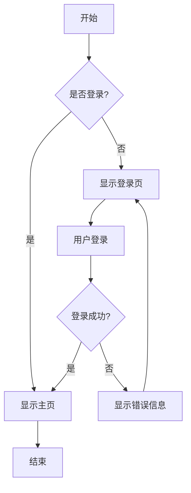
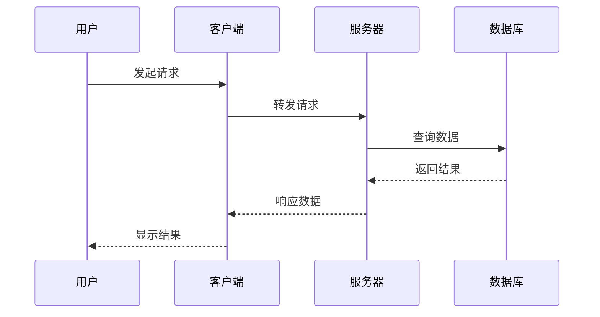
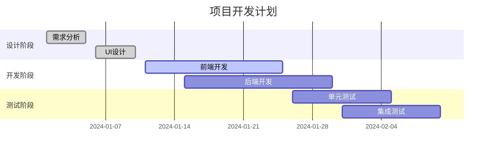
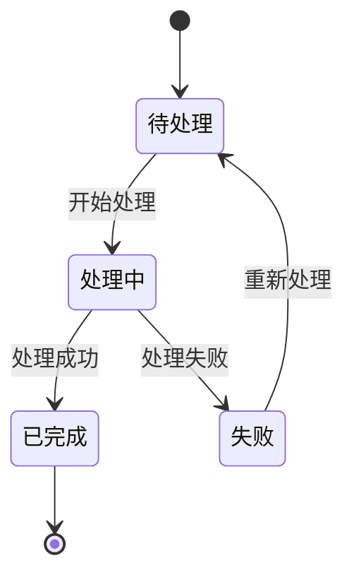

# 高级功能测试

这个文档用于测试新实现的高级功能。

## 1. Callout 块测试

### 信息类 Callout

> [!note] 这是一个笔记
> 这里是笔记的内容，用于记录重要信息。
> 可以有多行内容。

> [!info] 信息提示
> 这是一个信息类型的 callout 块。

> [!tip] 实用提示
> 这里提供一些有用的提示和技巧。

### 警告类 Callout

> [!warning] 警告信息
> 这是一个警告，请注意相关风险。

> [!caution] 注意事项
> 请仔细阅读以下注意事项。

### 错误类 Callout

> [!error] 错误信息
> 这里描述了一个错误情况。

> [!danger] 危险警告
> 这是一个危险操作的警告。

### 成功类 Callout

> [!success] 操作成功
> 操作已经成功完成。

> [!check] 检查完成
> 所有检查项目都已通过。

### 问题类 Callout

> [!question] 常见问题
> 这里是一些常见问题的解答。

> [!help] 帮助信息
> 如果需要帮助，请参考以下信息。

### 其他类型 Callout

> [!quote] 引用内容
> 这是一段重要的引用内容。

> [!example] 示例说明
> 这里提供一个具体的示例。

> [!todo] 待办事项
> - [ ] 完成功能开发
> - [ ] 编写测试用例
> - [ ] 更新文档

## 2. 文本高亮测试

这里有一些==重要的高亮文本==，需要特别注意。

在段落中可以有==多个高亮==的==不同部分==。

==整段高亮的文本内容，用于强调重要信息==。

## 3. Mermaid 图表测试

### 流程图

### 序列图

### 甘特图

## 4. 混合内容测试

> [!warning] 重要提醒
> 在使用 Mermaid 图表时，请确保==语法正确==，否则可能无法正常渲染。

下面是一个简单的状态图：

> [!success] 测试完成
> 所有高级功能的测试用例都已经包含在这个文档中。

## 5. 复杂嵌套测试

> [!info] 复杂内容示例
> 这个 callout 包含了多种元素：
> 
> 1. ==高亮文本==
> 2. **粗体文本**
> 3. *斜体文本*
> 4. `代码片段`
> 5. [链接示例](https://example.com)
> 
> 还可以包含列表和其他 Markdown 元素。

这样就完成了所有高级功能的测试覆盖。
